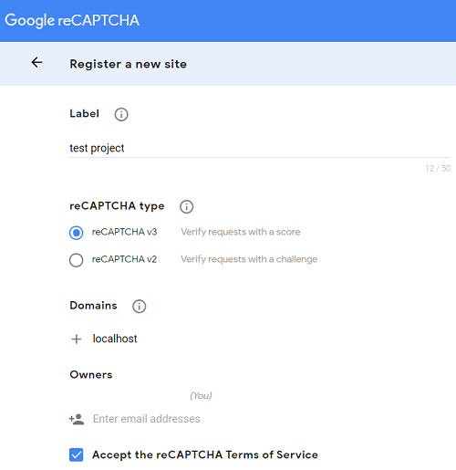
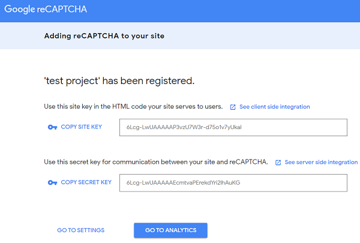

### What is a reCAPTCHA V3 ? 

reCAPTCHA v3 returns a score for each request without user friction. The score is based on interactions with your site and enables you to take an appropriate action for your site. 


### Integrating Google's reCAPTCHA V3 on Spring Boot App

We first need to register our site with the service, add their library to our page, and then verify the user's captcha response with the web-service.
Register your site at https://www.google.com/recaptcha/admin. The registration process generates a **site-key** and **secret-key** for accessing the web-service.





### Storing API Site & Secret Key
Keys are can be stored in `application.properties` file.

```text
google.recaptcha.key.site=6Lcg-LwUAAAAAP3...
google.recaptcha.key.secret=6Lcg-LwUAAAAAEcm...
```

We can expose them to Spring using a bean annotated with @ConfigurationProperties:
```java
@Component
@ConfigurationProperties(prefix = "google.recaptcha.key")
public class CaptchaKeys {
 
    private String site;
    private String secret;
 
    // standard getters and setters
}
```

### Get a Response From Front-End
```html
<!DOCTYPE html>
<html>
<head>
 
...
 
<script src='https://www.google.com/recaptcha/api.js'></script>
</head>
<body>
 
    ...
 
    <form action="/" method="POST" enctype="utf8">
        ...
 
        <div class="g-recaptcha col-sm-5"
          th:attr="data-sitekey=${@captchaSettings.getSite()}"></div>
        <span id="captchaError" class="alert alert-danger col-sm-4"
          style="display:none"></span>
```

### Validate on Server Side
The user's response to the reCAPTCHA challenge is retrieved from the request parameter g-recaptcha-response using HttpServletRequest and validated with our CaptchaService. Any exception thrown while processing the response will abort the rest of the registration logic:
```java
public class RegistrationController {
 
    @Autowired
    private ICaptchaService captchaService;
 
    ...
 
    @RequestMapping(value = "/token", method = RequestMethod.POST)
    public @ResponseBody GoogleResponse registerUserAccount(@Valid UserDto accountDto, HttpServletRequest request) {
        String response = request.getParameter("g-recaptcha-response");
        return captchaService.processResponse(response);
 
        // Rest of implementation
    }
 
    ...
}
```
```java
@Service
public class CaptchaService implements ICaptchaService {
 
    @Autowired
    private CaptchaKeys captchaKeys;
 
    @Autowired
    private RestOperations restTemplate;
 
    private static Pattern RESPONSE_PATTERN = Pattern.compile("[A-Za-z0-9_-]+");
 
    @Override
    public GoogleResponse processResponse(String response) {
        String url = "https://www.google.com/recaptcha/api/siteverify";
		
		RestTemplate restTemplate = new RestTemplate();
		
		HttpHeaders headers = new HttpHeaders();
		headers.setContentType(MediaType.APPLICATION_FORM_URLENCODED);

		MultiValueMap<String, String> map= new LinkedMultiValueMap<String, String>();
		map.add("secret", captchaKeys.getSecret());
		map.add("response", response);

		HttpEntity<MultiValueMap<String, String>> request = new HttpEntity<MultiValueMap<String, String>>(map, headers);

		GoogleResponse response = restTemplate.postForObject( url, request, RecaptchaDTO.class );
		
		return response;
    }
 
    private boolean responseSanityCheck(String response) {
        return StringUtils.hasLength(response) && RESPONSE_PATTERN.matcher(response).matches();
    }
}
```

### Objectifying the Validation
```java
@JsonInclude(JsonInclude.Include.NON_NULL)
@JsonIgnoreProperties(ignoreUnknown = true)
@JsonPropertyOrder({
    "success",
    "challenge_ts",
    "hostname",
    "score",
	"action"
})
public class GoogleResponse {
 
    @JsonProperty("success")
    private boolean success;
     
    @JsonProperty("challenge_ts")
    private String challengeTs;
     
    @JsonProperty("hostname")
    private String hostname;
	
	@JsonProperty("score")
	private String score;
     
    @JsonProperty("action")
    private String  action;
 
 
	@Override
	public String toString() {
		return "RecaptchaDTO [success=" + success + ", challenge_ts=" + challenge_ts + ", hostname=" + hostname
				+ ", score=" + score + ", action=" + action + "]";
	}
     
    // standard getters and setters
}
```